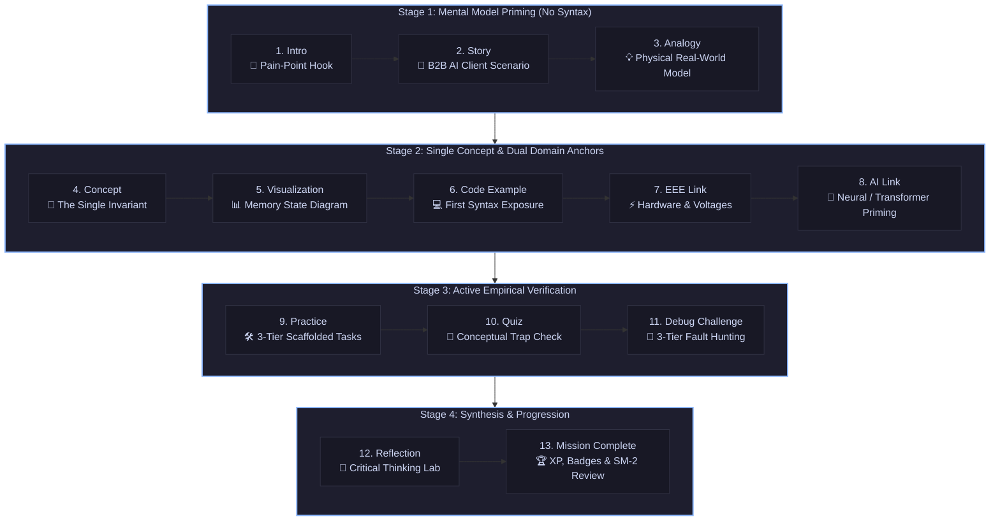
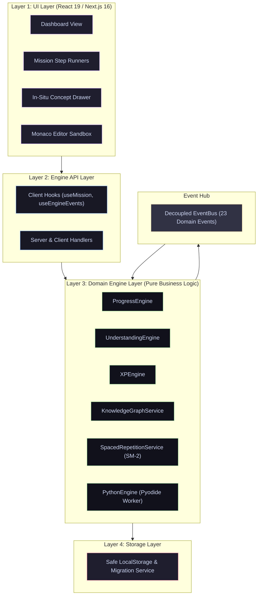
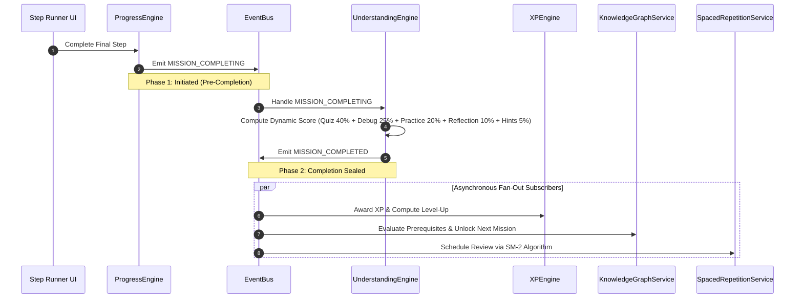

<div align="center">

# 🌌 NEXUS ACADEMY
### *The Browser-Native Python & Computer Science Laboratory in Bangla*

[](https://nexus-academy-xqcn.vercel.app)
[-10B981?style=for-the-badge&logo=checkmarx&logoColor=white)](https://github.com/hasan-circuito/nexus-academy)
[](https://nextjs.org/)
[](https://reactjs.org/)
[](https://www.typescriptlang.org/)
[](https://pyodide.org/)
[](https://nexus-academy-xqcn.vercel.app)
[](LICENSE)

<br/>

> **English Hook:** An interactive, browser-native Python & CS learning laboratory in Bangla — built on WebAssembly Pyodide, AST syntax enforcement, and deep cognitive mental models. No rote memorization, no server execution cost.
>
> **বাংলা রূপরেখা:** বাংলায় ইন্টারঅ্যাক্টিভ পাইথন ও কম্পিউটার সায়েন্স ল্যাবরেটরি — *"গভীরভাবে বোঝো, মুখস্থ নয়" — ব্রাউজার-নেটিভ Pyodide WASM ও AST সিনট্যাক্স কনফাইনমেন্ট সমৃদ্ধ।*

---

[🌐 Explore Live Platform](https://nexus-academy-xqcn.vercel.app) • [📋 14 Published Missions](#-current-curriculum-milestone-status-14-published-missions) • [🗺️ 120-Mission Roadmap Table](#️-120-mission-curriculum-roadmap-5-phases) • [🏗️ Architecture Deep Dive](#️-system-architecture--engineering) • [🧪 Testing Records](#-testing--quality-assurance-1640-assertions)

</div>

<br/>

> [!IMPORTANT]
> **To the Anthropic / Claude for Open Source Review Team**:  
> Most programming education platforms in the developing world treat software engineering as passive syntax transcription: learners endure 10-hour YouTube playlists, memorizing keywords without building computational mental models. **NEXUS Academy** is an open-source, client-side educational runtime engineered to dismantle that paradigm for 250+ million Bengali speakers. Powered by WebAssembly (Pyodide), an event-driven decoupled architecture, and static AST syntax confinement, it turns learning into an active laboratory running entirely inside the student's browser with **zero backend infrastructure cost and zero learner data exposure**.

---

## 🖥️ Live Platform Preview

```
+----------------------------------------------------------------------------------------------------+
| 🌌 NEXUS Academy [M001: Variables & Memory]      [Python 3.12 Pyodide Worker: ACTIVE (0ms Latency)]|
+---------------------------------------------------+------------------------------------------------+
| 📖 BENGALI PEDAGOGICAL STAGE                      | 💻 MONACO CODE LABORATORY                      |
|                                                   |                                                |
| ধাপ ৫: ভিজ্যুয়ালাইজেশন (Memory Box Model)         | 1  # Patient Vitals Tracker (HealthTech)       |
|                                                   | 2  patient_name = "Rahim"                      |
| মেমোরিতে একটি নামযুক্ত বাক্স তৈরি হলো:            | 3  heart_rate = 72                             |
| +-----------------+                               | 4  print(f"Patient: {patient_name}")           |
| | heart_rate = 72 |                               | 5  print(f"Pulse: {heart_rate} BPM")           |
| +-----------------+                               |                                                |
| [Single Concept Law: Zero Cognitive Leaks]        | [▶ Run Code]  [↺ Reset]  [💡 Hint]             |
|                                                   +------------------------------------------------+
| 💡 বাস্তব সাদৃশ্য (Analogy):                     | 📟 TERMINAL OUTPUT                             |
| ভ্যারিয়েবল হলো কাগজের লেবেল লাগানো ড্রয়ার।      | > Executing in client-side Web Worker (WASM)   |
| মান বদলালে ড্রয়ারের ভেতরের জিনিস বদলায়,         | Patient: Rahim                                 |
| কিন্তু লেবেল একই থাকে।                            | Pulse: 72 BPM                                  |
|                                                   | [✓ AST Check Passed | Exit Code 0]             |
+---------------------------------------------------+------------------------------------------------+
| 🧭 Progress: [●][●][●][●][●][○][○][○][○][○][○][○][○] (Step 5 of 13) | ⌘K: In-Situ Concept Drawer    |
+----------------------------------------------------------------------------------------------------+
```

---

## 🎯 The "Learner #0" Origin Story

### Escaping "Tutorial Hell" in South Asia
In Bangladesh and across South Asia, over 250 million native Bengali speakers face a critical barrier to high-tier software engineering. The dominant learning materials fall into two extremes:
1. **Shallow Rote YouTube Playlists:** Instructors dictate `print("Hello World")`, declare variables, and ask students to blindly copy syntax without revealing memory pointer mechanics, state mutations, or hardware allocation models.
2. **Dense English Documentation:** High-caliber computer science texts remain linguistically intimidating, causing early cognitive overload and abandonment.

When software bugs occur, learners freeze because they were taught **what** to type, never **why** the computer interprets it that way.

### Built by Learner #0 (Dogfooder #1)
NEXUS Academy was founded by **Hasan Mahmud Fahim** ([@hasan-circuito](https://github.com/hasan-circuito)), an Electrical & Electronic Engineering (EEE) student. Refusing to settle for superficial syntax drills, Hasan engineered NEXUS Academy by adopting the persona of **Learner #0**:
- Every concept step is audited against the **Single Concept Law**: an absolute beginner must experience **zero cognitive leaps** between steps.
- The curriculum implements **Domain-Appropriate Debugging (Rule 21)** and **The Closed-World Invariant (Rule 24)**: learners are never forced to debug syntax they have not yet mastered.
- Real-world grounding through the **B2B AI Agency Framework (Rule 22)**: learners take on the role of a junior engineer at *Nexus AI*, building software for real rotating industry clients across FinTech, HealthTech, Logistics, AgriTech, GovTech, Smart Grid, and E-Commerce.

---

## ⚡ Core Engineering Pillars

```
+-----------------------------------------------------------------------------------+
|                           NEXUS ACADEMY CORE CAPABILITIES                         |
+------------------------------------+----------------------------------------------+
| 🌐 100% Browser-Native Pyodide     | 0ms execution latency, 0 server compute bills|
| 🔒 AST Syntax Confinement (Rule 24)| Real Python 3.12 AST blocks unearned syntax  |
| 🧠 4-Tier Cognitive Scaffolding    | Story -> Analogy -> Concept -> EEE / AI Demo |
| ⚡ Decoupled 23-Event EventBus     | 4-layer dependency model with max depth <= 3 |
| 🪟 In-Situ Concept Drawer & Sandbox| Contextual lookup without loss of step state |
| 🩺 Contextual Error Diagnostics    | Localized Bengali root-cause analysis & fixes|
| 📈 Spaced Repetition Engine (SM-2) | Personalized retention tracking in local state|
+------------------------------------+----------------------------------------------+
```

### 1. WebAssembly (Pyodide) in a Dedicated Web Worker
- **Zero Server Overhead:** All user code compiles and executes directly inside the browser using Pyodide (WASM) compiled from CPython 3.12.
- **Privacy & Offline Independence:** Learners retain complete ownership of their data. The application requires zero backend runtime and functions entirely offline once cached.
- **Dedicated Worker Threading:** Long-running loops or intensive operations execute off the main thread, keeping the Monaco Editor and UI buttery smooth at 60 FPS.

### 2. Closed-World Invariant & Python AST Checker (Rule 24)
A catastrophic flaw in educational platforms is cognitive leakage—where starter code secretly contains `for` loops, classes, or imports before the student has learned them. NEXUS Academy enforces an automated AST walker:
```bash
# Validating forbidden syntax across all published missions
$ node scripts/test-curriculum-pipeline.mjs
✓ [PASS] Direct For loop caught with exit code 2
✓ [PASS] Nested ListComp in f-string caught with exit code 2
✓ [PASS] FunctionDef caught with exit code 2
✓ [PASS] Permitted syntax passes AST walker cleanly with exit code 0
```
If a mission introduces concepts beyond its declared scope (`learnerKnownScope`), automated CI halts the deployment immediately.

### 3. The 13-Step Mission Anatomy Pipeline
Every curriculum mission is crafted as an unbroken intellectual journey across 4 distinct pedagogical stages:



---

## 🏗️ System Architecture & Engineering

NEXUS Academy follows a strict **Four-Layer Architecture** where dependencies point strictly inward. Engines never call each other directly—they coordinate purely through an asynchronous **EventBus**.

### Layered Dependency Model



### Two-Phase Mission Completion Flow
To avoid race conditions and maintain clean scoring provenance, mission completion is split into two phases:



---

## 📊 Current Curriculum Milestone Status (14 Published Missions)

All 14 published missions are authored, schema-validated, and verified through automated end-to-end Python AST compilation.

| Mission ID | English Title | Bengali Title | Client Industry (Rule 22) | Primary Concept Mastered | Status |
|:---|:---|:---|:---|:---|:---:|
| **M001** | Software Memory & Variables | সফটওয়্যারের মেমোরি | HealthTech (Patient Vitals) | Variables & `print()` standard output | `✓ Passed` |
| **M002** | Using Software Memory | মেমোরি ব্যবহার | FinTech (Ledger Balance) | Variable usage & referencing in `print()` | `✓ Passed` |
| **M003** | When Memory Changes | মেমোরি যখন বদলে যায় | Logistics (Shipment Tracking) | Variable reassignment & state mutation | `✓ Passed` |
| **M004** | When Information Has a Type | সব তথ্য কি একই ধরনের? | EdTech (Student Records) | Type distinction: `str` vs `int` | `✓ Passed` |
| **M005** | When Information Must Change Form | Information বদলাতে হলে কী হবে? | GovTech (Citizen Portals) | Type casting: `int()` and `str()` | `✓ Passed` |
| **M006** | The Assignment Pipeline | অ্যাসাইনমেন্ট পাইপলাইন | Smart Grid (Power Allocation) | Integer arithmetic (`+`, `-`, `*`) & right-to-left `=` flow | `✓ Passed` |
| **M007** | When Numbers Have Decimals | সংখ্যার ভগ্নাংশ: ভাগফল ও ফ্লোট | AgriTech (Soil Sensor Ratios) | Float data type, `/` operator, and `ZeroDivisionError` | `✓ Passed` |
| **M008** | The Listening Software | সফটওয়্যার যখন কানে শোনে | HRTech (Employee Onboarding) | User input via `input()` & string concatenation | `✓ Passed` |
| **M009** | Dynamic Math | ক্যালকুলেটরে প্রাণদান | RetailTech (Dynamic Checkout) | Numeric input casting with `int(input())` | `✓ Passed` |
| **M010** | Modern String Formatting | বাক্যের শূন্যস্থান | E-Commerce (Order Invoicing) | Formatted string literals (`f-strings`) | `✓ Passed` |
| **M011** | Boolean Logic | সফটওয়্যারের সুইচ | FinTech (Security Switches) | Boolean type (`True` and `False` literals) | `✓ Passed` |
| **M012** | Comparison Operators | মেমোরির দাঁড়িপাল্লা | E-Commerce (Discount Gates) | Evaluation operators (`==`, `!=`, `<`, `>`, `<=`, `>=`) | `✓ Passed` |
| **M013** | Nexus Progress Report | নেক্সাস প্রগ্রেস রিপোর্ট | Education Technology | Capstone integration of M001–M012 (0 new concepts) | `✓ Passed` |
| **M014** | When Software Takes One Path | সফটওয়্যার যখন সিদ্ধান্ত নেয় | E-Commerce (Cart Routing) | Conditional execution using the `if` statement | `✓ Passed` |

---

## 🗺️ 120-Mission Curriculum Roadmap (5 Phases)

The complete pedagogical master plan guides Bengali learners from absolute zero to production-grade AI and Machine Learning engineering.

### 5-Phase Master Blueprint Table

| Phase | Mission Range | Pedagogical Focus | Core Capabilities Mastered | Capstone Deliverable |
|:---:|:---:|:---|:---|:---|
| **Phase 1: Foundation** | **001–025** | Zero to first principles; deterministic control flow | Variables, types, casting, assignment flow, floats, dynamic terminal math, f-strings, booleans, comparison operators, `if/elif/else`, `while` & `for` loops, lists, and indexing | **M025**: Interactive Command-Line Financial Calculator |
| **Phase 2: Builder** | **026–050** | Modular construction, defensive systems & persistence | The DRY principle, function definitions (`def`), arguments, scope boundaries, return contracts, dictionaries, sets, tuples, error anatomy (`try/except/finally/raise`), file I/O streaming, JSON serialization, and comprehensions | **M050**: Production-Grade Task & Audit Manager with JSON persistence & fault recovery |
| **Phase 3: Engineer** | **051–075** | Scalable architecture, object-orientation & testing rigor | OOP (classes, encapsulation, constructors, inheritance, dunder methods), packages & virtual environments (`venv`), functional streams (`map`, `filter`, `yield`), decorators, and automated unit testing with `pytest`, mocking & `pdb` | **M075**: Modular Inventory Management System backed by comprehensive test coverage |
| **Phase 4: Data & ML** | **076–100** | Numerical vectorization, data pipelines & ML primitives | The limits of pure Python, NumPy vectorization, Pandas DataFrames & Series, EDA (Matplotlib/Seaborn), Classical ML (Regression, Decision Trees, Random Forests), NLP (TF-IDF), and Vector Embeddings / RAG | **M100**: Customer Support Intent Classifier & Autonomous RAG Agent |
| **Phase 5: Agentic AI** | **101–120** | High-concurrency production deployments & agentic systems | Modern Python typing/dataclasses, memory management & GIL internals, `asyncio` event loops, FastAPI web microservices, Pydantic validation, Docker containerization, CI/CD Actions, and Production LLM Agents | **M120**: Full-Lifecycle Autonomous ML Web Microservice (Train → Containerize → Serve → Monitor) |

<br/>

<details open>
<summary><b>🔍 Click to view Phase-by-Phase Detailed Milestone Tables</b></summary>

#### Phase 1: Foundation (Missions 001–025)
*Target: Mastery of fundamental Python constructs and deterministic control flow.*

| Mission ID | Title / Concept | Technical Focus | Client Domain |
|:---|:---|:---|:---|
| **001–005** | Variables, Types & Memory | Memory allocation, `print()`, `str` vs `int`, Type Conversion | HealthTech, FinTech, GovTech |
| **006–010** | Assignment Pipeline & Math | `=`, arithmetic operators, float division (`/`), `input()`, `f-strings` | Smart Grid, AgriTech, Retail |
| **011–016** | Boolean Logic & Conditionals | `True`/`False`, comparison operators, `if`, `else`, `elif`, `and`/`or`/`not` | FinTech, E-Commerce, Logistics |
| **017–020** | Repetition & Loops | Scalability limits of copy-paste, `while`, `break`, `continue` | Robotics, Quality Control |
| **021–024** | Sequences & Iteration | Lists, zero-based indexing, in-place mutation, `for` loops, `range()` | Supply Chain, Fleet Logistics |
| **025** | **Phase 1 Capstone** | Command-Line Financial Calculator integrating all Phase 1 concepts | FinTech Mini-Platform |

#### Phase 2: Builder (Missions 026–050)
*Target: Modular code organization, defensive error handling, and structured file persistence.*

| Mission ID | Title / Concept | Technical Focus | Client Domain |
|:---|:---|:---|:---|
| **026–031** | Reusable Logic (Functions) | DRY principle, `def`, parameters, `return`, local/global scope, kwargs | SaaS Billing, API Clients |
| **032–036** | Structured Data Collections | Dictionaries, nested maps, immutable tuples, unique sets, string ops | Healthcare Records, CRM |
| **037–041** | Defensive Engineering | Exceptions (`ValueError`, `KeyError`), `try/except`, `finally`, `raise` | Payment Gateways, Telemetry |
| **042–046** | Files & Serialization | `with` context manager, line streaming, JSON serialization, CSV ops | Audit Logging, Data Ingestion |
| **047–049** | Expressive Python | List & dict comprehensions, modular imports (`utils.py`, `models.py`) | Micro-Utilities |
| **050** | **Phase 2 Capstone** | Task & Audit Manager with JSON persistence and defensive error recovery | Enterprise Operations |

#### Phase 3: Engineer (Missions 051–075)
*Target: Production system design, object orientation, and rigorous automated testing.*

| Mission ID | Title / Concept | Technical Focus | Client Domain |
|:---|:---|:---|:---|
| **051–059** | Object-Oriented Design | Classes, `__init__`, state encapsulation, inheritance, polymorphism, dunder methods | Banking Core, Simulation |
| **060–063** | Packaging & Environments | Module hierarchies, `__init__.py`, `venv` isolation, `pip` & dependencies | Tooling & Infrastructure |
| **064–068** | Functional Streams & Memory | `map`, `filter`, `zip`, lambdas, iterator protocol, lazy `yield` generators | High-Throughput Streaming |
| **069–070** | Advanced Meta-Programming | Function decorators, timing wrappers, parameterized decorators | Middleware & Instrumentation |
| **071–074** | Automated Testing & QA | Test-driven philosophy, `pytest` fixtures, mocking dependencies, `pdb` | Mission-Critical Engineering |
| **075** | **Phase 3 Capstone** | Modular Inventory Management System with 100% Pytest assertion coverage | Logistics Warehousing |

#### Phase 4: Applied Data Science & ML Primitives (Missions 076–100)
*Target: High-performance vectorized numerical computation, data pipelines, and machine learning models.*

| Mission ID | Title / Concept | Technical Focus | Client Domain |
|:---|:---|:---|:---|
| **076–082** | Numerical Python & EDA | Pure Python limits, NumPy vectorization, Pandas DataFrames, cleaning, Seaborn | Sensor Networks, Ad Analytics |
| **083–090** | Classical Machine Learning | Rules vs Patterns, features/labels, train/test split, Linear & Logistic Regression, Trees | Predictive Maintenance, Churn |
| **091–094** | Natural Language Processing | Text tokenization, stopword filtering, TF-IDF vectorization, text classification | Spam Detection, Content Routing |
| **095–099** | LLMs, APIs & Vector RAG | Transformer mechanics, Claude/OpenAI APIs, code prompt engineering, RAG pipelines | Generative Support Systems |
| **100** | **Phase 4 Capstone** | Customer Support Ticket Intent Classifier & Autonomous RAG Retrieval Agent | AI Agency Customer Ops |

#### Phase 5: Professional & Agentic AI Systems (Missions 101–120)
*Target: High-concurrency production deployments, web APIs, containerization, and autonomous AI agents.*

| Mission ID | Title / Concept | Technical Focus | Client Domain |
|:---|:---|:---|:---|
| **101–106** | Advanced Python Internals | Modern dataclasses, protocols, garbage collection, CPython GIL, memory profiling | High-Performance Computing |
| **107–111** | Concurrency & Async I/O | Concurrency vs parallelism, threading, multiprocessing, `asyncio`, event loops | Real-Time Scrapers & Feeds |
| **112–114** | Production Web APIs | FastAPI microservices, Pydantic schema validation, ML model inference endpoints | Production API Gateway |
| **115–119** | DevOps & Cloud Readiness | Docker containerization, structured logging, CLI tools (`argparse`), CI/CD Actions | Cloud Deployment Pipelines |
| **120** | **Final Capstone Project** | Full-Lifecycle Autonomous ML Web Microservice (Train → Containerize → Serve → Monitor) | Autonomous AI Enterprise |

</details>

---

## 🧪 Testing & Quality Assurance (1,640+ Assertions)

Code correctness is not an afterthought at NEXUS Academy—it is an automated gate. The platform executes **7 specialized validation suites** validating missions, domain events, dictionary indices, error diagnostics, settings safety, curriculum graph dependencies, and step state persistence.

Highlight: **1,189 test assertions passing** as our foundational benchmark, and now **1,640+ automated test assertions passing 100%** across the entire platform.

```bash
$ npm test
```

```
======================================================
🧪 NEXUS ACADEMY — AUTOMATED VALIDATION HARNESS
======================================================

1️⃣ Mission Schema & Pedagogy Validator (scripts/validate-missions.mjs)
   ✓ Validated 14 Published Missions against MES standard
   ✓ Real Python 3.12 AST compilation on all code snippets
   ✓ 745 / 745 assertions passed (100%)

2️⃣ Decoupled EventBus & Domain Lifecycle Flow (scripts/test-event-bus.mjs)
   ✓ Phase 1: MISSION_COMPLETING triggered
   ✓ Phase 2: MISSION_COMPLETED dynamic scoring computed & emitted
   ✓ Phase 3: Fan-out to XP, Knowledge Graph & Spaced Repetition
   ✓ 6 / 6 phases & assertions passed (100%)

3️⃣ Dictionary & Mental Model Problem-Solving Hub (scripts/validate-dictionary.mjs)
   ✓ 20 comprehensive computer science concept entries verified
   ✓ Dual-language search & symptom keyword resolution verified
   ✓ 628 / 628 assertions passed (100%)

4️⃣ Contextual Error Diagnostics Engine (scripts/test-error-diagnostics.mjs)
   ✓ 15 real learner micro-error patterns tested (e.g. Quoted Variables, Missing Colons)
   ✓ Localized Bengali explanations & 1-line exact fixes verified
   ✓ 44 / 44 assertions passed (100%)

5️⃣ Settings, Dev Mode & State Safety Suite (scripts/test-settings.mjs)
   ✓ Theme switcher & Monaco theme synchronization verified
   ✓ LocalStorage backup, export, import & danger zone reset verified
   ✓ 22 / 22 tests passed (100%)

6️⃣ Curriculum Pipeline & AST Forbidden Syntax Walker (scripts/test-curriculum-pipeline.mjs)
   ✓ Preflight contracts, prerequisites & single concept boundaries verified
   ✓ AST walker detects forbidden loops, comprehensions & function defs
   ✓ 170 / 170 tests passed (100%)

7️⃣ Step Persistence & Resume Safety Suite (scripts/test-step-persistence.mjs)
   ✓ Idempotent step navigation & variable-length mission progress verified
   ✓ Zero state loss across browser reloads
   ✓ 25 / 25 tests passed (100%)

======================================================
📊 TEST SUITE SUMMARY:
   Total Automated Assertions: 1,640
   Passed                    : 1,640 (✓ 100%)
   Failed                    : 0
======================================================
```

---

## 🤝 Alignment with Anthropic: Claude for Open Source

NEXUS Academy is actively applying to the **[Claude for Open Source Software](https://claude.com/contact-sales/claude-for-oss)** initiative.

### How Claude Accelerates This Project
1. **Automated Pedagogical Audit:** We utilize Claude as an architectural critic to review educational scaffolding, verify cognitive step transitions, and detect hidden cognitive leaps before curriculum missions are packaged.
2. **AST Constraint Generation:** Claude assists in mapping newly introduced programming concepts to strict Python AST node visitor rules, ensuring zero untaught syntax leaks into starter templates or debugging exercises.
3. **High-Fidelity Bengali Pedagogical Engineering:** Translating complex computational concepts into culturally resonant Bengali analogies requires nuanced linguistic intelligence. Claude’s superior reasoning enables us to craft analogies that retain strict technical accuracy without falling back on awkward phonetic transliterations.
4. **B2B AI Agency Domain Modeling:** Engineering believable business domain problems (Rule 22) across FinTech, HealthTech, Smart Grid, and AgriTech requires diverse domain knowledge that Claude synthesizes seamlessly.

> [!TIP]
> **Why Support NEXUS Academy?**  
> An Anthropic Claude sponsorship directly accelerates our roadmap to author the remaining 106 missions, empowering millions of underrepresented South Asian developers to gain first-principles computer science mastery completely free of charge.

---

## 🚀 Quick Start & Local Development

### Prerequisites
- **Node.js**: `v18.18.0` or higher
- **npm**: `v9.0.0` or higher
- **Python**: `v3.10+` (Used by test runners for native AST validation)

### 1. Clone the Repository
```bash
git clone https://github.com/hasan-circuito/nexus-academy.git
cd nexus-academy
```

### 2. Install Dependencies
```bash
npm install
```

### 3. Run the Automated Test Suite
Ensure all **1,189+ foundational assertions** and current **1,640+ automated assertions** pass:
```bash
npm test
```

### 4. Launch the Development Server
```bash
npm run dev
```
Open [http://localhost:3000](http://localhost:3000) in your browser to interact with the learning laboratory.

### 5. Curriculum Authoring CLI Tools
```bash
# Run preflight verification on a mission before publishing
npm run mission:preflight 014

# Scaffold a new mission skeleton conforming to Rule 24
npm run mission:scaffold 015
```

---

## 🛠 Tech Stack

| Domain | Technology | Purpose |
|:---|:---|:---|
| **Framework** | Next.js 16 (Turbopack) | Modern React Server Components & App Router |
| **Frontend Engine** | React 19 + TypeScript 5 | Strict component typing and declarative state |
| **Code Execution** | Pyodide (WASM) Web Worker | 100% client-side CPython 3.12 sandbox |
| **Code Editor** | Monaco Editor (`@monaco-editor/react`) | VS Code-caliber in-browser editing experience |
| **Styling** | Tailwind CSS v4 + shadcn/ui | Minimalist, dark-mode first terminal aesthetic |
| **Icons** | Lucide React | Crisp, accessible iconography |
| **Validation** | Python AST (`ast.parse`) | Static syntax analysis and constraint checking |

---

## 📄 License & Contributing

### Contributing
We warmly welcome contributions from educators, Python engineers, and open-source enthusiasts! Please check out our [Contributing Guidelines](CONTRIBUTING.md) and [Code of Conduct](CODE_OF_CONDUCT.md).

To propose a new mission or improve existing pedagogical analogies:
1. Fork the repo and create your branch: `git checkout -b feature/mission-improvement`.
2. Ensure all tests pass: `npm test`.
3. Open a Pull Request with a clear rationale of the cognitive improvements.

### License
This project is licensed under the **MIT License** — see the [LICENSE](LICENSE) file for details.

---

<div align="center">
  <sub>Crafted with passion for first-principles computer science education by <b>Hasan Mahmud Fahim</b> ([@hasan-circuito](https://github.com/hasan-circuito)) and open-source contributors worldwide.</sub>
  <br/>
  <sub>© 2026 NEXUS Academy. All rights reserved.</sub>
</div>
