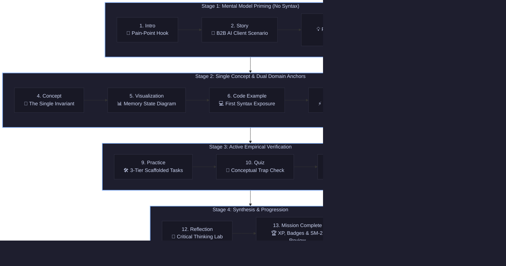
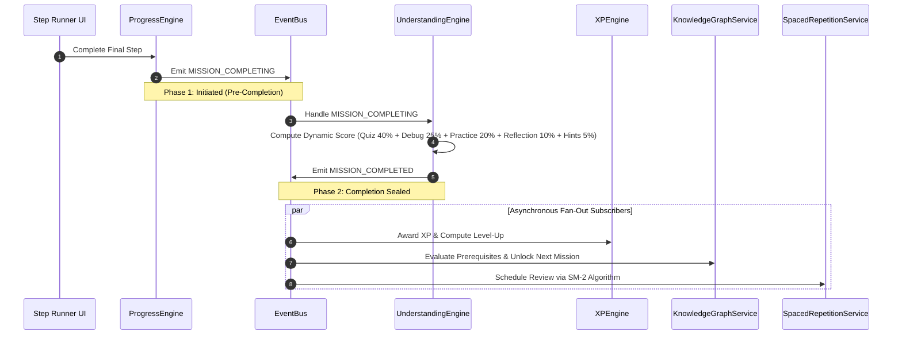

<div align="center">

# 🌌 NEXUS ACADEMY
### *The Browser-Native Python & Computer Science Laboratory in Bangla*

[](https://nexus-academy-xqcn.vercel.app)
[-10B981?style=for-the-badge&logo=checkmarx&logoColor=white)](https://github.com/hasan-circuito/nexus-academy)
[](https://github.com/hasan-circuito/nexus-academy)
[](https://nextjs.org/)
[](https://reactjs.org/)
[](https://www.typescriptlang.org/)
[](https://pyodide.org/)
[](https://nexus-academy-xqcn.vercel.app)
[](LICENSE)

<br/>

> **English Hook:** An interactive, browser-native Python & CS learning laboratory in Bangla — built on WebAssembly Pyodide, AST syntax enforcement, and deep cognitive mental models. No rote memorization, no server execution cost.
>
> **বাংলা রূপরেখা:** বাংলায় ইন্টারঅ্যাক্টিভ পাইথন ও কম্পিউটার সায়েন্স ল্যাবরেটরি — *"গভীরভাবে বোঝো, মুখস্থ নয়" — ব্রাউজার-নেটিভ Pyodide WASM ও AST সিনট্যাক্স কনফাইনমেন্ট সমৃদ্ধ।*

---

[🌐 Explore Live Platform](https://nexus-academy-xqcn.vercel.app) • [⚡ What Makes This Different](#what-makes-this-different) • [🏗️ Architecture Tree](#architecture-tree) • [📋 14 Published Missions](#published-missions) • [🗺️ 120-Mission Roadmap](#curriculum-roadmap) • [🧪 Testing Records](#testing-records)

</div>

<br/>

> [!IMPORTANT]
> **To the Anthropic / Claude for Open Source Review Team (Ecosystem Impact Track)**:  
> **NEXUS Academy** is an open-source, 100% client-side Python & Computer Science learning laboratory engineered specifically for **250+ million native Bengali speakers**. Powered by WebAssembly (CPython 3.12 in Pyodide), compile-time AST syntax confinement (Rule 24), and an asynchronous 23-event architecture, it delivers a zero-latency learning runtime directly in the browser—with **$0 server compute overhead and zero learner data exposure**. We are applying to the Claude for Open Source initiative to leverage Claude's deep reasoning for continuous pedagogical auditing, AST rule generation, and culturally grounded computational modeling across our 120-mission roadmap.

---

## 🚨 The Problem: The South Asian Computer Science Divide

Across Bangladesh and South Asia, over **250 million native Bengali speakers** face a systemic bottleneck when entering modern software engineering and AI:

1. **The Rote YouTube Epidemic:** The dominant entry point consists of 10-hour passive video playlists where instructors dictate `print("Hello World")` and variables. Learners mechanically transcribe syntax without understanding memory allocation, pointer mechanics, state mutations, or hardware execution models.
2. **The Double Cognitive Penalty:** High-tier computer science documentation and interactive platforms are overwhelmingly English-first. Beginners are forced to decipher an unfamiliar natural language while simultaneously wrestling with abstract computational logic.
3. **The "Tutorial Hell" Abandonment Trap:** When a learner encounters their first unexpected runtime exception, they freeze and abandon learning because they were taught *what* code to type, never *how* the runtime actually reasons.

---

<a id="what-makes-this-different"></a>

## ⚡ What Makes NEXUS Academy Different

| Dimension | Traditional Platforms (freeCodeCamp, Codecademy, Coursera) | NEXUS Academy |
| :--- | :--- | :--- |
| **1. Linguistic Grounding** | English-first or automated subtitles; alien metaphors for non-Western learners | **Native Bengali First Principles**; culturally resonant mental models and analogies with a built-in bilingual (`bn` ↔ `en`) dual-track roadmap |
| **2. Compute Infrastructure & Cost** | Costly server-side execution sandboxes; strict rate limits, queue latency, privacy risks | **100% Client-Side WebAssembly (Pyodide)**; dedicated Web Worker execution with 0ms latency, $0 server compute bills, and full offline capability |
| **3. Cognitive Guardrails** | Unearned syntax leaks (starter code introduces loops or functions before taught); high learner dropouts | **AST-Enforced Closed-World Invariant (Rule 24)**; automated Python 3.12 AST visitors reject any unearned syntax at compile time |
| **4. Pedagogical Depth** | Passive copy-pasting, superficial syntax drills, shallow quiz questions | **13-Step First-Principles Anatomy**; Story → Physical Analogy → Memory Box Diagram → Hardware EEE Link → AI Link → 3-Tier Fault Hunting |
| **5. Practical Context** | Abstract toy problems (`foo(x) + bar(y)`, calculating area of rectangle) | **B2B AI Agency Framework (Rule 22)**; junior engineer at *Nexus AI* solving rotating client challenges (FinTech, HealthTech, Smart Grid, AgriTech) |

---

## 🚀 Current Project Status & Traction

- [x] **151+ Commits**: Active, sustained open-source development with strict git discipline and semantic versioning.
- [x] **14 Published Missions (M001–M014)**: Authored, schema-validated, and verified through automated end-to-end Python AST compilation.
- [x] **1,189 Foundational Assertions & 1,640+ Total Automated Tests (100% Pass)**: 7 specialized test suites covering missions, domain events, AST walkers, error diagnostics, settings safety, and step persistence.
- [x] **Active Sprint on Mission 015**: Branching logic & conditional decision-making (`if-else`) currently in active development.
- [x] **Zero Cognitive Leaks**: Automated preflight and AST CI pipeline halting deployment if unearned syntax is introduced.
- [x] **Live Production Platform**: Instant zero-friction access at [nexus-academy-xqcn.vercel.app](https://nexus-academy-xqcn.vercel.app) (zero signup walls, instant WASM execution).

---

<a id="architecture-tree"></a>

## 🏗️ In-Browser System Architecture

```
Browser (100% Client-Side Runtime • Zero Server Compute Bills • Offline-Capable)
│
├── ⚡ Presentation Layer (Next.js 16 + React 19 + TypeScript 5)
│   ├── Monaco Code Editor (VS Code engine in-browser)
│   ├── Interactive Terminal & Stream Output
│   └── In-Situ Concept Drawer & Spaced Repetition Flashcards
│
├── 🐍 Execution Engine (Web Worker Thread)
│   ├── Pyodide WASM (CPython 3.12 compiled to WebAssembly)
│   ├── Off-Main-Thread Worker Isolation (Buttery 60 FPS UI)
│   └── Virtual Stdin/Stdout Buffering & Interactive Input Emulation
│
├── 🔒 Cognitive & Pedagogical Integrity (Python AST Walker)
│   ├── Closed-World Invariant (Rule 24) AST Visitor
│   ├── Forbidden Syntax Trap Detection (Exit Code 2 on untaught constructs)
│   └── Single Concept Law & Prerequisite Contract Verification
│
├── 🧠 Domain Logic & Event Bus (Decoupled 23-Event Architecture)
│   ├── Two-Phase Mission Completion Flow (Initiated ➔ Sealed)
│   ├── UnderstandingEngine (Dynamic Scoring: Quiz 40% + Debug 25% + Practice 20% + Reflection 10% + Hints 5%)
│   ├── XPEngine & Level Progression
│   ├── KnowledgeGraphService (DAG Prerequisite Traversal)
│   └── SpacedRepetitionService (SuperMemo SM-2 Interval Calculation)
│
└── 💾 Storage & State Safety (Local First)
    ├── Safe LocalStorage with JSON Schema Migration
    ├── Idempotent Step Navigation & Variable-Length Mission State
    └── Zero Learner Telemetry / Zero Private Data Exposure
```

---

## 🖥️ Interactive Laboratory Blueprint

> 🌐 **Experience the Live Web Application:** [nexus-academy-xqcn.vercel.app](https://nexus-academy-xqcn.vercel.app)

```
+----------------------------------------------------------------------------------------------------+
| 🌌 NEXUS Academy [M001: Variables & Memory]      [Python 3.12 Pyodide Worker: ACTIVE (0ms Latency)]|
+---------------------------------------------------+------------------------------------------------+
| 📖 BENGALI PEDAGOGICAL STAGE                      | 💻 MONACO CODE LABORATORY                      |
|                                                   |                                                |
| ধাপ ৫: ভিজ্যুয়ালাইজেশন (Memory Box Model)         | 1  # Patient Vitals Tracker (HealthTech)       |
|                                                   | 2  patient_name = "Rahim"                      |
| মেমোরিতে একটি নামযুক্ত বাক্স তৈরি হলো:            | 3  heart_rate = 72                             |
| +-----------------+                               | 4  print(f"Patient: {patient_name}")           |
| | heart_rate = 72 |                               | 5  print(f"Pulse: {heart_rate} BPM")           |
| +-----------------+                               |                                                |
| [Single Concept Law: Zero Cognitive Leaks]        | [▶ Run Code]  [↺ Reset]  [💡 Hint]             |
|                                                   +------------------------------------------------+
| 💡 বাস্তব সাদৃশ্য (Analogy):                     | 📟 TERMINAL OUTPUT                             |
| ভ্যারিয়েবল হলো কাগজের লেবেল লাগানো ড্রয়ার।      | > Executing in client-side Web Worker (WASM)   |
| মান বদলালে ড্রয়ারের ভেতরের জিনিস বদলায়,         | Patient: Rahim                                 |
| কিন্তু লেবেল একই থাকে।                            | Pulse: 72 BPM                                  |
|                                                   | [✓ AST Check Passed | Exit Code 0]             |
+---------------------------------------------------+------------------------------------------------+
| 🧭 Progress: [●][●][●][●][●][○][○][○][○][○][○][○][○] (Step 5 of 13) | ⌘K: In-Situ Concept Drawer    |
+----------------------------------------------------------------------------------------------------+
```

---

## 🎯 Pedagogical Philosophy: Built by "Learner #0"

NEXUS Academy was founded by **Hasan Mahmud Fahim** ([@hasan-circuito](https://github.com/hasan-circuito)), an Electrical & Electronic Engineering (EEE) student. Refusing to settle for passive syntax drills, Hasan engineered NEXUS Academy by adopting the persona of **Learner #0**—stress-testing every lesson against two foundational pedagogical pillars:

1. **Dual Domain Anchoring (Hardware EEE ➔ Modern AI):** Rather than treating code as disconnected syntax, every mission connects abstract software constructs downward to physical hardware (voltage gates, memory registers, clock cycles) and upward to modern AI paradigms (tensors, token embeddings, transformer attention weights).
2. **Bangla-First ➔ Global Bilingual Bridge:**
   - *Phase 1 (Current Foundation):* Deep native grounding in culturally resonant Bengali analogies removes linguistic friction, enabling learners to build authentic computational mental models.
   - *Phase 2 (Upcoming Horizon):* Extensible bilingual dual-track schema (`bn` ↔ `en`), empowering learners to seamlessly toggle between Bengali conceptual intuition and international open-source English terminology.

---

## ⚡ Core Engineering Pillars

### 1. WebAssembly (Pyodide) in a Dedicated Web Worker
- **Zero Server Overhead:** All user code compiles and executes directly inside the browser using Pyodide (WASM) compiled from CPython 3.12.
- **Privacy & Offline Independence:** Learners retain complete ownership of their data. The application requires zero backend runtime and functions entirely offline once cached.
- **Dedicated Worker Threading:** Long-running loops or intensive operations execute off the main thread, keeping the Monaco Editor and UI buttery smooth at 60 FPS.

### 2. Closed-World Invariant & Python AST Checker (Rule 24)
A catastrophic flaw in educational platforms is cognitive leakage—where starter code secretly contains `for` loops, classes, or imports before the student has learned them. NEXUS Academy enforces an automated AST walker:
```bash
# Validating forbidden syntax across all published missions
$ node scripts/test-curriculum-pipeline.mjs
✓ [PASS] Direct For loop caught with exit code 2
✓ [PASS] Nested ListComp in f-string caught with exit code 2
✓ [PASS] FunctionDef caught with exit code 2
✓ [PASS] Permitted syntax passes AST walker cleanly with exit code 0
```
If a mission introduces concepts beyond its declared scope (`learnerKnownScope`), automated CI halts the deployment immediately.

### 3. The 13-Step Mission Anatomy Pipeline
Every curriculum mission is crafted as an unbroken intellectual journey across 4 distinct pedagogical stages:



### 4. Decoupled 23-Event EventBus & Two-Phase Completion Flow
To avoid race conditions and maintain clean scoring provenance, engines never call each other directly—they coordinate purely through an asynchronous **EventBus**:



---

<a id="published-missions"></a>

## 📊 Current Curriculum Milestone Status (14 Published Missions)

All 14 published missions are authored, schema-validated, and verified through automated end-to-end Python AST compilation.

| Mission ID | English Title | Bengali Title | Client Industry (Rule 22) | Primary Concept Mastered | Status |
|:---|:---|:---|:---|:---|:---:|
| **M001** | Software Memory & Variables | সফটওয়্যারের মেমোরি | HealthTech (Patient Vitals) | Variables & `print()` standard output | `✓ Passed` |
| **M002** | Using Software Memory | মেমোরি ব্যবহার | FinTech (Ledger Balance) | Variable usage & referencing in `print()` | `✓ Passed` |
| **M003** | When Memory Changes | মেমোরি যখন বদলে যায় | Logistics (Shipment Tracking) | Variable reassignment & state mutation | `✓ Passed` |
| **M004** | When Information Has a Type | সব তথ্য কি একই ধরনের? | EdTech (Student Records) | Type distinction: `str` vs `int` | `✓ Passed` |
| **M005** | When Information Must Change Form | Information বদলাতে হলে কী হবে? | GovTech (Citizen Portals) | Type casting: `int()` and `str()` | `✓ Passed` |
| **M006** | The Assignment Pipeline | অ্যাসাইনমেন্ট পাইপলাইন | Smart Grid (Power Allocation) | Integer arithmetic (`+`, `-`, `*`) & right-to-left `=` flow | `✓ Passed` |
| **M007** | When Numbers Have Decimals | সংখ্যার ভগ্নাংশ: ভাগফল ও ফ্লোট | AgriTech (Soil Sensor Ratios) | Float data type, `/` operator, and `ZeroDivisionError` | `✓ Passed` |
| **M008** | The Listening Software | সফটওয়্যার যখন কানে শোনে | HRTech (Employee Onboarding) | User input via `input()` & string concatenation | `✓ Passed` |
| **M009** | Dynamic Math | ক্যালকুলেটরে প্রাণদান | RetailTech (Dynamic Checkout) | Numeric input casting with `int(input())` | `✓ Passed` |
| **M010** | Modern String Formatting | বাক্যের শূন্যস্থান | E-Commerce (Order Invoicing) | Formatted string literals (`f-strings`) | `✓ Passed` |
| **M011** | Boolean Logic | সফটওয়্যারের সুইচ | FinTech (Security Switches) | Boolean type (`True` and `False` literals) | `✓ Passed` |
| **M012** | Comparison Operators | মেমোরির দাঁড়িপাল্লা | E-Commerce (Discount Gates) | Evaluation operators (`==`, `!=`, `<`, `>`, `<=`, `>=`) | `✓ Passed` |
| **M013** | Nexus Progress Report | নেক্সাস প্রগ্রেস রিপোর্ট | Education Technology | Capstone integration of M001–M012 (0 new concepts) | `✓ Passed` |
| **M014** | When Software Takes One Path | সফটওয়্যার যখন সিদ্ধান্ত নেয় | E-Commerce (Cart Routing) | Conditional execution using the `if` statement | `✓ Passed` |

---

<a id="curriculum-roadmap"></a>

## 🗺️ 120-Mission Curriculum Roadmap (5 Phases)

The complete pedagogical master plan guides Bengali learners from absolute zero to production-grade AI and Machine Learning engineering.

### 5-Phase Master Blueprint Table

| Phase | Mission Range | Pedagogical Focus | Core Capabilities Mastered | Capstone Deliverable |
|:---:|:---:|:---|:---|:---|
| **Phase 1: Foundation** | **001–025** | Zero to first principles; deterministic control flow | Variables, types, casting, assignment flow, floats, dynamic terminal math, f-strings, booleans, comparison operators, `if/elif/else`, `while` & `for` loops, lists, and indexing | **M025**: Interactive Command-Line Financial Calculator |
| **Phase 2: Builder** | **026–050** | Modular construction, defensive systems & persistence | The DRY principle, function definitions (`def`), arguments, scope boundaries, return contracts, dictionaries, sets, tuples, error anatomy (`try/except/finally/raise`), file I/O streaming, JSON serialization, and comprehensions | **M050**: Production-Grade Task & Audit Manager with JSON persistence & fault recovery |
| **Phase 3: Engineer** | **051–075** | Scalable architecture, object-orientation & testing rigor | OOP (classes, encapsulation, constructors, inheritance, dunder methods), packages & virtual environments (`venv`), functional streams (`map`, `filter`, `yield`), decorators, and automated unit testing with `pytest`, mocking & `pdb` | **M075**: Modular Inventory Management System backed by comprehensive test coverage |
| **Phase 4: Data & ML** | **076–100** | Numerical vectorization, data pipelines & ML primitives | The limits of pure Python, NumPy vectorization, Pandas DataFrames & Series, EDA (Matplotlib/Seaborn), Classical ML (Regression, Decision Trees, Random Forests), NLP (TF-IDF), and Vector Embeddings / RAG | **M100**: Customer Support Intent Classifier & Autonomous RAG Agent |
| **Phase 5: Agentic AI** | **101–120** | High-concurrency production deployments & agentic systems | Modern Python typing/dataclasses, memory management & GIL internals, `asyncio` event loops, FastAPI web microservices, Pydantic validation, Docker containerization, CI/CD Actions, and Production LLM Agents | **M120**: Full-Lifecycle Autonomous ML Web Microservice (Train → Containerize → Serve → Monitor) |

<br/>

<details>
<summary><b>🔍 Click to view Phase-by-Phase Detailed Milestone Tables</b></summary>

#### Phase 1: Foundation (Missions 001–025)
*Target: Mastery of fundamental Python constructs and deterministic control flow.*

| Mission ID | Title / Concept | Technical Focus | Client Domain |
|:---|:---|:---|:---|
| **001–005** | Variables, Types & Memory | Memory allocation, `print()`, `str` vs `int`, Type Conversion | HealthTech, FinTech, GovTech |
| **006–010** | Assignment Pipeline & Math | `=`, arithmetic operators, float division (`/`), `input()`, `f-strings` | Smart Grid, AgriTech, Retail |
| **011–016** | Boolean Logic & Conditionals | `True`/`False`, comparison operators, `if`, `else`, `elif`, `and`/`or`/`not` | FinTech, E-Commerce, Logistics |
| **017–020** | Repetition & Loops | Scalability limits of copy-paste, `while`, `break`, `continue` | Robotics, Quality Control |
| **021–024** | Sequences & Iteration | Lists, zero-based indexing, in-place mutation, `for` loops, `range()` | Supply Chain, Fleet Logistics |
| **025** | **Phase 1 Capstone** | Command-Line Financial Calculator integrating all Phase 1 concepts | FinTech Mini-Platform |

#### Phase 2: Builder (Missions 026–050)
*Target: Modular code organization, defensive error handling, and structured file persistence.*

| Mission ID | Title / Concept | Technical Focus | Client Domain |
|:---|:---|:---|:---|
| **026–031** | Reusable Logic (Functions) | DRY principle, `def`, parameters, `return`, local/global scope, kwargs | SaaS Billing, API Clients |
| **032–036** | Structured Data Collections | Dictionaries, nested maps, immutable tuples, unique sets, string ops | Healthcare Records, CRM |
| **037–041** | Defensive Engineering | Exceptions (`ValueError`, `KeyError`), `try/except`, `finally`, `raise` | Payment Gateways, Telemetry |
| **042–046** | Files & Serialization | `with` context manager, line streaming, JSON serialization, CSV ops | Audit Logging, Data Ingestion |
| **047–049** | Expressive Python | List & dict comprehensions, modular imports (`utils.py`, `models.py`) | Micro-Utilities |
| **050** | **Phase 2 Capstone** | Task & Audit Manager with JSON persistence and defensive error recovery | Enterprise Operations |

#### Phase 3: Engineer (Missions 051–075)
*Target: Production system design, object orientation, and rigorous automated testing.*

| Mission ID | Title / Concept | Technical Focus | Client Domain |
|:---|:---|:---|:---|
| **051–059** | Object-Oriented Design | Classes, `__init__`, state encapsulation, inheritance, polymorphism, dunder methods | Banking Core, Simulation |
| **060–063** | Packaging & Environments | Module hierarchies, `__init__.py`, `venv` isolation, `pip` & dependencies | Tooling & Infrastructure |
| **064–068** | Functional Streams & Memory | `map`, `filter`, `zip`, lambdas, iterator protocol, lazy `yield` generators | High-Throughput Streaming |
| **069–070** | Advanced Meta-Programming | Function decorators, timing wrappers, parameterized decorators | Middleware & Instrumentation |
| **071–074** | Automated Testing & QA | Test-driven philosophy, `pytest` fixtures, mocking dependencies, `pdb` | Mission-Critical Engineering |
| **075** | **Phase 3 Capstone** | Modular Inventory Management System with 100% Pytest assertion coverage | Logistics Warehousing |

#### Phase 4: Applied Data Science & ML Primitives (Missions 076–100)
*Target: High-performance vectorized numerical computation, data pipelines, and machine learning models.*

| Mission ID | Title / Concept | Technical Focus | Client Domain |
|:---|:---|:---|:---|
| **076–082** | Numerical Python & EDA | Pure Python limits, NumPy vectorization, Pandas DataFrames, cleaning, Seaborn | Sensor Networks, Ad Analytics |
| **083–090** | Classical Machine Learning | Rules vs Patterns, features/labels, train/test split, Linear & Logistic Regression, Trees | Predictive Maintenance, Churn |
| **091–094** | Natural Language Processing | Text tokenization, stopword filtering, TF-IDF vectorization, text classification | Spam Detection, Content Routing |
| **095–099** | LLMs, APIs & Vector RAG | Transformer mechanics, Claude/OpenAI APIs, code prompt engineering, RAG pipelines | Generative Support Systems |
| **100** | **Phase 4 Capstone** | Customer Support Ticket Intent Classifier & Autonomous RAG Retrieval Agent | AI Agency Customer Ops |

#### Phase 5: Professional & Agentic AI Systems (Missions 101–120)
*Target: High-concurrency production deployments, web APIs, containerization, and autonomous AI agents.*

| Mission ID | Title / Concept | Technical Focus | Client Domain |
|:---|:---|:---|:---|
| **101–106** | Advanced Python Internals | Modern dataclasses, protocols, garbage collection, CPython GIL, memory profiling | High-Performance Computing |
| **107–111** | Concurrency & Async I/O | Concurrency vs parallelism, threading, multiprocessing, `asyncio`, event loops | Real-Time Scrapers & Feeds |
| **112–114** | Production Web APIs | FastAPI microservices, Pydantic schema validation, ML model inference endpoints | Production API Gateway |
| **115–119** | DevOps & Cloud Readiness | Docker containerization, structured logging, CLI tools (`argparse`), CI/CD Actions | Cloud Deployment Pipelines |
| **120** | **Final Capstone Project** | Full-Lifecycle Autonomous ML Web Microservice (Train → Containerize → Serve → Monitor) | Autonomous AI Enterprise |

</details>

---

<a id="testing-records"></a>

## 🧪 Testing & Quality Assurance (1,640+ Assertions)

Code correctness is an automated gate at NEXUS Academy. The repository features **1,189 foundational assertions** and now **1,640+ automated test assertions passing 100%** across 7 specialized validation suites validating missions, domain events, dictionary indices, error diagnostics, settings safety, curriculum graph dependencies, and step state persistence.

```bash
$ npm test
```

```
======================================================
🧪 NEXUS ACADEMY — AUTOMATED VALIDATION HARNESS
======================================================

1️⃣ Mission Schema & Pedagogy Validator (scripts/validate-missions.mjs)
   ✓ Validated 14 Published Missions against MES standard
   ✓ Real Python 3.12 AST compilation on all code snippets
   ✓ 745 / 745 assertions passed (100%)

2️⃣ Decoupled EventBus & Domain Lifecycle Flow (scripts/test-event-bus.mjs)
   ✓ Phase 1: MISSION_COMPLETING triggered
   ✓ Phase 2: MISSION_COMPLETED dynamic scoring computed & emitted
   ✓ Phase 3: Fan-out to XP, Knowledge Graph & Spaced Repetition
   ✓ 6 / 6 phases & assertions passed (100%)

3️⃣ Dictionary & Mental Model Problem-Solving Hub (scripts/validate-dictionary.mjs)
   ✓ 20 comprehensive computer science concept entries verified
   ✓ Dual-language search & symptom keyword resolution verified
   ✓ 628 / 628 assertions passed (100%)

4️⃣ Contextual Error Diagnostics Engine (scripts/test-error-diagnostics.mjs)
   ✓ 15 real learner micro-error patterns tested (e.g. Quoted Variables, Missing Colons)
   ✓ Localized Bengali explanations & 1-line exact fixes verified
   ✓ 44 / 44 assertions passed (100%)

5️⃣ Settings, Dev Mode & State Safety Suite (scripts/test-settings.mjs)
   ✓ Theme switcher & Monaco theme synchronization verified
   ✓ LocalStorage backup, export, import & danger zone reset verified
   ✓ 22 / 22 tests passed (100%)

6️⃣ Curriculum Pipeline & AST Forbidden Syntax Walker (scripts/test-curriculum-pipeline.mjs)
   ✓ Preflight contracts, prerequisites & single concept boundaries verified
   ✓ AST walker detects forbidden loops, comprehensions & function defs
   ✓ 170 / 170 tests passed (100%)

7️⃣ Step Persistence & Resume Safety Suite (scripts/test-step-persistence.mjs)
   ✓ Idempotent step navigation & variable-length mission progress verified
   ✓ Zero state loss across browser reloads
   ✓ 25 / 25 tests passed (100%)

======================================================
📊 TEST SUITE SUMMARY:
   Total Automated Assertions: 1,640
   Passed                    : 1,640 (✓ 100%)
   Failed                    : 0
======================================================
```

---

<a id="claude-for-oss"></a>

## 🤝 Alignment with Anthropic: Claude for Open Source

NEXUS Academy is actively applying to the **[Claude for Open Source Software](https://claude.com/contact-sales/claude-for-oss)** initiative under the **Ecosystem Impact Track**.

### How Claude Accelerates This Project
1. **Automated Pedagogical Auditing:** We utilize Claude as an architectural critic to review educational scaffolding, verify cognitive step transitions, and detect hidden cognitive leaps before curriculum missions are packaged.
2. **AST Constraint Generation:** Claude assists in mapping newly introduced programming concepts to strict Python AST node visitor rules, ensuring zero untaught syntax leaks into starter templates or debugging exercises.
3. **High-Fidelity Bengali Pedagogical Engineering:** Translating complex computational concepts into culturally resonant Bengali analogies requires nuanced linguistic intelligence. Claude’s superior reasoning enables us to craft analogies that retain strict technical accuracy without falling back on awkward phonetic transliterations.
4. **B2B AI Agency Domain Modeling:** Engineering believable business domain problems (Rule 22) across FinTech, HealthTech, Smart Grid, and AgriTech requires diverse domain knowledge that Claude synthesizes seamlessly.

> [!TIP]
> **Why Support NEXUS Academy?**  
> An Anthropic Claude sponsorship directly accelerates our roadmap to author the remaining 106 missions, empowering millions of underrepresented South Asian developers to gain first-principles computer science mastery completely free of charge.

---

## 🚀 Quick Start & Local Development

### Prerequisites
- **Node.js**: `v18.18.0` or higher
- **npm**: `v9.0.0` or higher
- **Python**: `v3.10+` (Used by test runners for native AST validation)

### 1. Clone the Repository
```bash
git clone https://github.com/hasan-circuito/nexus-academy.git
cd nexus-academy
```

### 2. Install Dependencies
```bash
npm install
```

### 3. Run the Automated Test Suite
Ensure all **1,189+ foundational assertions** and current **1,640+ automated assertions** pass:
```bash
npm test
```

### 4. Launch the Development Server
```bash
npm run dev
```
Open [http://localhost:3000](http://localhost:3000) in your browser to interact with the learning laboratory.

### 5. Curriculum Authoring CLI Tools
```bash
# Run preflight verification on a mission before publishing
npm run mission:preflight 014

# Scaffold a new mission skeleton conforming to Rule 24
npm run mission:scaffold 015
```

---

## 🛠 Core Technologies

- **Frontend & Runtime:** [Next.js 16](https://nextjs.org/) (Turbopack) • [React 19](https://reactjs.org/) • [TypeScript 5](https://www.typescriptlang.org/) • [Tailwind CSS v4](https://tailwindcss.com/) • [shadcn/ui](https://ui.shadcn.com/)
- **Client Execution & Analysis:** [Pyodide WASM](https://pyodide.org/) (CPython 3.12 Web Worker) • [Monaco Editor](https://microsoft.github.io/monaco-editor/) • Python 3.12 AST (`ast.parse`)
- **State & Architecture:** Decoupled 23-Event EventBus • SuperMemo SM-2 Spaced Repetition Engine • Schema-Migrated Safe LocalStorage

---

## 📄 License & Contributing

### Contributing
We warmly welcome contributions from educators, Python engineers, and open-source enthusiasts! Please check out our [Contributing Guidelines](CONTRIBUTING.md) and [Code of Conduct](CODE_OF_CONDUCT.md).

To propose a new mission or improve existing pedagogical analogies:
1. Fork the repo and create your branch: `git checkout -b feature/mission-improvement`.
2. Ensure all tests pass: `npm test`.
3. Open a Pull Request with a clear rationale of the cognitive improvements.

### License
This project is licensed under the **MIT License** — see the [LICENSE](LICENSE) file for details.

---

<div align="center">
  <sub>Crafted with passion for first-principles computer science education by <b>Hasan Mahmud Fahim</b> ([@hasan-circuito](https://github.com/hasan-circuito)) and open-source contributors worldwide.</sub>
  <br/>
  <sub>© 2026 NEXUS Academy. All rights reserved.</sub>
</div>
